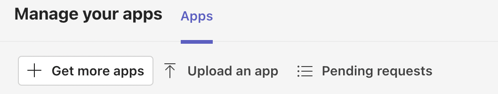
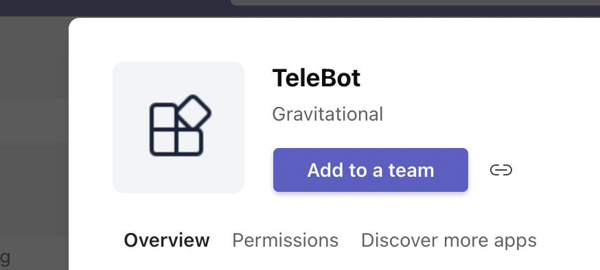
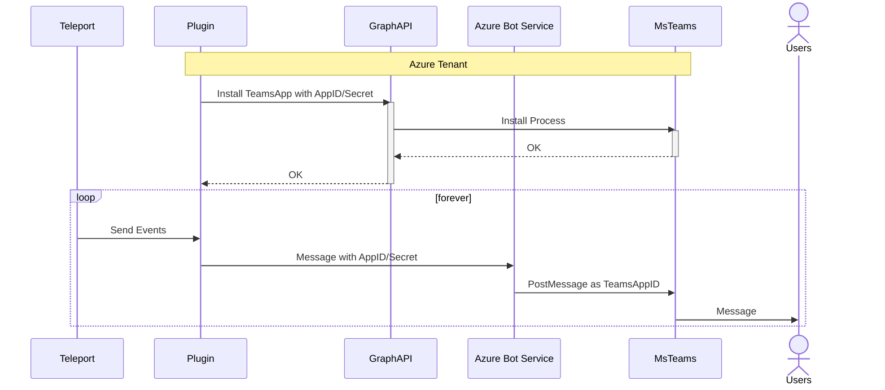

# Teleport MS Teams Plugin

This plugin notifies MS Teams users on upcoming AccessRequests.

## Install the plugin

There are several methods to installing and using the Teleport MS Teams Plugin:

1. Use a [precompiled binary](#precompiled-binary)

2. Use a [docker image](#docker-image)

3. Install from [source](#building-from-source)

### Precompiled Binary

Get the plugin distribution.

```bash
$ curl -L https://get.gravitational.com/teleport-access-msteams-v7.0.2-linux-amd64-bin.tar.gz
$ tar -xzf teleport-access-msteams-v7.0.2-linux-amd64-bin.tar.gz
$ cd teleport-access-msteams
$ ./install
```

### Docker Image
```bash
$ docker pull quay.io/gravitational/teleport-plugin-msteams:9.0.2
```

```bash
$ docker run quay.io/gravitational/teleport-plugin-msteams:9.0.2 version
teleport-msteams v9.0.2 git:teleport-msteams-v9.0.2-0-g9e149895 go1.17.8
```

For a list of available tags, visit [https://quay.io/](https://quay.io/repository/gravitational/teleport-plugin-msteams?tab=tags)

### Building from source

To build the plugin from source you need [Go](https://go.dev/) and `make`.

```bash
$ git clone https://github.com/gravitational/teleport-plugins.git
$ cd teleport-plugins/access/msteams
$ make
$ ./build/teleport-msteams start
```


## Teleport User and Role

Using Web UI or `tctl` CLI utility, create the role `access-msteams` and the user `access-msteams` belonging to the role `access-msteams`. You may use the following YAML declarations.

### Role

```yaml
kind: role
metadata:
  name: access-msteams
spec:
  allow:
    rules:
      - resources: ['access_request']
        verbs: ['list', 'read', 'update']
version: v6
```

### User

```yaml
kind: user
metadata:
  name: access-msteams
spec:
  roles: ['access-msteams']
version: v2
```

## Configure Microsoft Bot and App

You need a paid Azure subscription to make the plugin work.

Please note that you must have the appropriate Azure AD adminstrator permissions and MS Teams organization admin role to follow these steps. Contact your IT department administrator for details.

1. [Register new Azure bot](https://portal.azure.com/#create/Microsoft.AzureBot). Set "Single Tenant" type of app. Choose "Create new Microsoft App ID".

  

2. Open the newly created bot -> Channels tab. Add Microsoft Teams channel.

  

3. Open the associated Microsoft App (Configuration tab, find "Microsoft App ID", click "Manage" link next to it).

  

4. Go to "Certificates & secrets" section. Click "New client secret". Press "Add". Copy and save the generated password in a secure location.

  

5. Go to "API permissions" section. Click "Add a permission". Choose "Microsoft Graph". Choose "Application permissions". Add the following permissions:

* `TeamsAppInstallation.ReadWriteSelfForUser.All`
* `TeamsAppInstallation.ReadWriteSelfForTeam.All`
* `AppCatalog.Read.All`
* `User.Read.All`

6. Grant admin consent for the newly added permissions.

7. Goto the bot Configuration tab (back to step #3). Find "Microsoft App ID", "App Tenant ID" and run the following command:

```sh
$ ./teleport-msteams configure ~/ms_teams --appID <Microsoft App ID value> --tenantID <App Tenant ID value> --appSecret <password value saved on step #4>
```

`~ms_teams` must be a path to non existent folder. It will be created. All required files will be generated.

8. There will be `app.zip` in the target directory. This archive contains MS Teams app. If you want to change the application name, URLs and other settings, please update `manifest.json` and recreate `app.zip` from `color.png`, `outline.png` and `manifest.json`.

9. Upload the app to MS Teams organization store. Open "Apps", then "Manage your apps", click "Upload an app", choose "Upload an app to your org's app catalog", choose `app.zip` 

  

10. Add the newly uploaded app to a team. Open the app, click "Add to a team", choose team, click "Set up a bot".

  

## Validating the installation

```sh
$ ./teleport-msteams validate -c ~/ms_teams/teleport-msteams.toml foo@example.com
```

You'll see the following output:

```
 - Checking application 5eb63f63-da3a-4d77-8d35-55b5ef98f5be status...
 - Application found in the team app store (internal ID: c18f0770-4b36-453f-aa46-2d1ba552c238)
 - User foo@example.com found: 0x14000120800
 - Application installation ID for user: M2UwMzM3YmMtYjVkZC00YWRiLTliYzgtYTJhMTZjZDNiMDgxIyNjMThmMDc3MC00YjM2LTQ1M2YtYWE0Ni0yZDFiYTU1MmMyMzg=
 - Chat ID for user: 19:3e0337bc-b5dd-4adb-9bc8-a2a16cd3b081_2b6d7f7d-f8f3-4815-b50b-c7593c60981f@unq.gbl.spaces
 - Chat web URL: https://teams.microsoft.com/l/chat/19%3A3e0337bc-b5dd-4adb-9bc8-a2a16cd3b081_2b6d7f7d-f8f3-4815-b50b-c7593c60981f%40unq.gbl.spaces/0?tenantId=2ca235ec-37d0-44b0-964d-ca359e770603
 - Hailing the user...
 - Message sent, ID: 1657712789098

Check your MS Teams!
```

User receives "Hello, World!" message along with the mock access request.

  

You can use User ID instead of an email. To your User ID, open [Users](https://portal.azure.com/#view/Microsoft_AAD_IAM/UsersManagementMenuBlade/~/MsGraphUsers) section of the Azure Portal. Open a user and copy the "Object ID" field value.

## Running the plugin

With the config above, you should be able to run the bot invoking

```bash
$ teleport-msteams start -c ~/msteams/teleport-msteams.toml
```

or with docker:

```bash
$ docker run -v <path/to/config>:~/msteams/teleport-msteams.toml quay.io/gravitational/teleport-plugin-msteams:9.0.2 start
```

## Usage

Once your MS Teams plugin has been configured, you can verify that it's working
correctly by using `tctl request create <user> --roles=<roles>` to simulate an
access request.

Select `Deny` and verify that the request was indeed denied using
`tctl request ls`.

Specify ```preload = true``` at the top of your configuration file if you want plugin to check the user existence prior to startup.

## Plugin-specific Architecture

The plugin leverages 2 different Microsoft APIs to provide access-request notifications:


### The Bot Connector service

This is an Azure managed service that comes with an SDK (not available in golang) and allows developers to
write platform-agnostic messaging bots. It is billed per 1k messages and requires a valid Azure subscription.
We use this service only for posting messages to MSTeams, but it could be used to send messages to other destinations.

Warning: In this service, the term _channel_ represents the messaging connector used (Teams, Slack, Skype, ...).
Conversations abstract any kind of communication channel with the user like Private Messages, Group Chat or Team channel.
All inbound/outbound messages and events are called activities.

Using the Bot connector service requires an `AzureBot` resource in Azure, an application (service account) and a secret.

The Bot connector service should also be authorized to post on MSTeams, this is what the `TeamsApplication` does.
The Teams application is a ZIP file composed of an application manifest, a logo, and an accent color. It
contains the AzureBot ID that can interact on its behalf, an admin has to upload it to the Organisation AppCatalog.

### The Graph API

The Graph API allows to interact with a lot of Microsoft resources. This includes listing AD users, MsTeams 
applications, installing applications on their behalf, ... However, this API does not allow to post messages on Teams
(technically it is possible when doing a migration but Microsoft warns against using this method  for implementing a bot). 

The graph API has an official go client (currently in beta). While it works, the client is a heavy and make compiling
the plugin really slow (30 min of CPU time). As we also need to implement the authentication flow for the Bot Connector
service, we chose not to use the graph client.

MsTeams bot communication requires an already established communication channel. As we need to send notifications
without user interaction we can't have all users ping the bot. Thus, we pre-emptively install the app for each
recipient, this is our main use of the Graph API. Installing an app for a user can take several seconds.
As we need to treat each event before the HTTP timeout, the plugin is preloading by default and installing its Teams
app for all users.

Interacting with this API requires an application (service account) and an application secret. We reuse the Bot Connector
application and secret.
