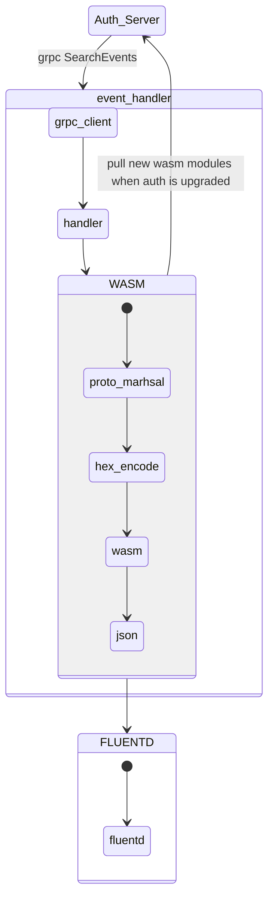

# RFD 3 - Event handler unknown events

## Required Approvers

* Engineering: @r0mant && ( @rosstimothy || @edoardo )

## What

Customers want to deploy Teleport event handlers that can successfully handle
all types of events. Currently, Teleport does not provide a way to handle new
events that are not known to the event handler. This RFD proposes a way to
handle unknown events when the Teleport event handler version is not up to date
with the Teleport Auth server version.

## Why

The Teleport Auth server and Teleport event handler are two separate components
that are deployed independently. This means that the event handler can be
deployed with a version that is not up to date with the Auth server version.

When the event handler is not up to date with the Auth server, it will not be
able to handle new events that are not known to the event handler. This can
cause the event handler to crash (previous behavior) or ignore the unknown events.

This is problematic because the event handler is a critical component that
should be able to handle all types of events. If the event handler is not able
to handle new events, it can  miss important events and drift from the Auth server truth.

The Teleport event handler receives events from the Auth server, serializes them
using JSON and sends them to the upstream service (e.g. Splunk, FluentD, etc).
When the event handler is not up to date with the Auth server, the new events
will not be known to the event handler and the protobuf raw cannot be deserialized.
Without the deserialized event, the event handler cannot serialize the event
using JSON and send it to the upstream service. We could send the raw protobuf
to auth server and have the auth server serialize it to JSON but this is not
ideal because it will add a lot of overhead to the Auth server and will add
a lot of latency to the event handler.

Currently, the event handler ignores unknown events.

## Proposal

The proposal consists of having Auth server serving a WASM module that can perform
the protobuf deserialization and JSON serialization given a raw protobuf event.
Since the WASM module is served by the Auth server, it will always be up to date
with the Auth server protobuf version and the event handler will be able to
download the WASM module each time the Auth server is upgraded/downgraded.

To detect if the event handler is up to date with the Auth server, the event handler
will send a gRPC request to the Auth server `Ping` endpoint to get the version of the Auth server.
If the version differs from the latest seen version, the event handler will download the WASM module.
If the WASM marshaling fails, the event handler will re-download the WASM module and try again
until it succeeds.

When the event handler receives an unknown event to its protobuf version, the protobuf
message includes a field called `XXX_unrecognized` that contains the raw slice of bytes
that wasn't able to be deserialized. If the message with `XXX_unrecognized` is marshaled
back to protobuf, the `XXX_unrecognized` field will be included in the marshaled message.
This means that the raw -> unmashaled -> marshaled -> raw path will be the same result
even if the message is unknown to the event handler.

With this in mind, the event handler will be able to send the raw protobuf event to the
WASM module that will deserialize the raw protobuf event - using the same protobuf version Auth has -
and serialize it to JSON, returning it to the caller that will send it to the upstream service.

The WASM module will be served by the Auth server and will be downloaded by the event handler
each time the Auth server is upgraded/downgraded.

## Considerations

### WASM module

Go 1.21 will have support for native WASI modules - `GOOS=wasip1 GOARCH=wasm`. This means that any Go program (sort of) can be
compiled to WASI and run as a WASI module without having to define custom non-trivial external functions.
This is a huge improvement over the current state of the art where you need to define custom external
functions to interact with the WASM (JS) module. Unfortunately, Go 1.21 is not released yet and it's unclear
if it will be released with support for WASI exported functions. Exported functions allow the caller to
initialize the WASM module once and call the exported functions multiple times. Without exported functions,
the caller needs to initialize the WASM module each time it wants to call a function. This is not ideal
because it will add a lot of overhead and will add a lot of latency to protobuf->JSON conversion (it's 400x slower than calling a WASM function).

Given that Teleport uses and abuses GoGo Protobuf for JSON serialization, it's not possible to have a
drop-in replacement for the current JSON serialization using another language that natively supports WASI.

Using TinyGo is also not an option because TinyGo does not support reflection and Protobuf uses reflection
internally to serialize/deserialize messages.

The only viable option is to use Go with `GOOS=js GOARCH=wasm`. This means that the routine will
be compiled to WASM and will be able to be executed by the event handler if the event handler WASM runtime
defines the same functions as `wasm_exec.js` file but written in Go (already supported by [wazero](https://github.com/tetratelabs/wazero)).

In the future, when Go 1.21 is released with exported functions, we can switch to Go 1.21 and use WASI modules instead of `GOOS=js` and `GOARCH=wasm` as it will be more efficient and will not require the `wasm_exec.js` equivalent. Keeping the same exported functions will allow us to keep compatibility with the event handler WASM runtime so we don't need to update the event handler.

Technically, we can run the event handler as a WASM module (gRPC clients...) but it will require that
the WASM module has access to the network and a larger module size and because of that, it was not pursued.

### Go Plugins

Go plugins are not an option because they are not supported on all platforms (e.g. macOS) and they are
not supported on all architectures (e.g. ARM). This means that we would need to compile the module for
each platform and architecture and have a different plugin for each platform and architecture. This is
not ideal because it will increase the maintenance burden and will increase the size of the teleport binary.

Besides that, Go plugins cannot be unloaded once they are loaded. This means that we would need to restart
the process each time the plugin is updated.

## Security Implications

Having the WASM module served by the Auth server means that the WASM module will be
executed in the same process as the event handler. WASM modules are sandboxed and
should not be able to escape the sandbox. This means that the WASM module should not
be able to access the event handler process memory or the host filesystem. But, we still
need to ensure the WASM module is the correct one and it is not a malicious WASM module.

The WASM module will be signed by Teleport and the event handler will verify the signature
before executing the WASM module.

