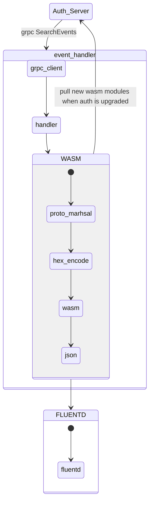

# RFD 3 - Event handler unknown events

## Required Approvers

* Engineering: @r0mant && ( @rosstimothy || @espadolini )

## What

Customers want to deploy Teleport event handlers that can successfully handle
all types of events. Currently, Teleport does not provide a way to handle new
events that are not known to the event handler. This RFD proposes a way to
handle unknown events when the Teleport event handler version is not up to date
with the Teleport Auth server version.

## Why

The Teleport Auth server and Teleport event handler are two separate components
that are deployed independently. This means that the event handler can be
deployed with a version that is not up to date with the Auth server version.

When the event handler is not up to date with the Auth server, it will not be
able to handle new events that are not known to the event handler. This can
cause the event handler to crash (previous behavior) or ignore the unknown events.

This is problematic because the event handler is a critical component that
should be able to handle all types of events. If the event handler is not able
to handle new events, it can miss important events and drift from the Auth server truth.

The Teleport event handler receives events from the Auth server, serializes them
using JSON and sends them to the upstream service (e.g. Splunk, FluentD, etc).
When the event handler is not up to date with the Auth server, the new events
will not be known to the event handler and the protobuf raw cannot be deserialized.
Without the deserialized event, the event handler cannot serialize the event
using JSON and send it to the upstream service. We could send the raw protobuf
to auth server and have the auth server serialize it to JSON but this is not
ideal because it will add a lot of overhead to the Auth server and will add
a lot of latency to the event handler.

Currently, the event handler ignores unknown events.

## Proposal

The proposal consists of having Auth server serve unstructured events when the
client requests those endpoints. This will allow the event handler to receive
the events with a JSON-like structure and send them to the upstream service without having to
deserialize the Protobuf and serialize it again to JSON.

To achieve this, we will add a new Protobuf service - `AuditLogService - to Auth server that will return
the events in an unstructured format. The event handler will use these endpoints to retrieve the events
and session events and convert them into plain JSON before pushing upstream.

The new service will be:

```protobuf

syntax = "proto3";

package teleport.auditlog.v1;

import "google/protobuf/struct.proto";
import "google/protobuf/timestamp.proto";

option go_package = "github.com/gravitational/teleport/api/gen/proto/go/teleport/auditlog/v1;auditlogv1";

// AuditLogService provides methods to access audit log.
service AuditLogService {
  // StreamUnstructuredSessionEvents streams audit events from a given session recording in an unstructured format.
  // This endpoint is used by the event handler to retrieve the session events as JSON.
  rpc StreamUnstructuredSessionEvents(StreamUnstructuredSessionEventsRequest) returns (stream EventUnstructured);
  // GetUnstructuredEvents gets events from the audit log in an unstructured format.
  // This endpoint is used by the event handler to retrieve the events as JSON.
  rpc GetUnstructuredEvents(GetUnstructuredEventsRequest) returns (EventsUnstructured);
}

// StreamUnstructuredSessionEventsRequest is a request containing needed data to fetch a session recording.
message StreamUnstructuredSessionEventsRequest {
  // session_id is the ID for a given session in an UUIDv4 format.
  string session_id = 1;
  // StartIndex is the index of the event to resume the stream after.
  // A start_index of 0 creates a new stream.
  int32 start_index = 2;
}

// Order specifies any ordering of some objects as returned in regards to some aspect
// of said objects which may be trivially ordered such as a timestamp.
enum Order {
  ORDER_DESCENDING_UNSPECIFIED = 0;
  ORDER_ASCENDING = 1;
}

// GetUnstructuredEventsRequest is a request with the needed data to fetch events.
message GetUnstructuredEventsRequest {
  // namespace, if not set, defaults to 'default'
  string namespace = 1;
  // start_date is the oldest date of returned events
  google.protobuf.Timestamp start_date = 2;
  // end_date is the newest date of returned events
  google.protobuf.Timestamp end_date = 3;
  // event_types is optional, if not set, returns all events
  repeated string event_types = 4;
  // limit is the maximum amount of events returned
  int32 limit = 5;
  // start_key is used to resume a query in order to enable pagination.
  // If the previous response had LastKey set then this should be
  // set to its value. Otherwise leave empty.
  string start_key = 6;
  // order specifies an ascending or descending order of events.
  // A value of 0 means a descending order and a value of 1 means an ascending order.
  Order order = 7;
}

// EventsUnstructured represents a list of events.AuditEvent in unstructured format.
message EventsUnstructured {
  // Items is a list of unstructured formatted audit events.
  repeated EventUnstructured items = 1;
  // the key of the last event if the returned set did not contain all events found i.e limit <
  // actual amount. this is the key clients can supply in another API request to continue fetching
  // events from the previous last position
  string last_key = 2;
}

// EventUnstructured represents a siggle events.AuditEvent in an unstructured format.
message EventUnstructured {
  // type is the type of the event.
  string type = 1;
  // id is the unique ID of the event.
  // If the underlying event defines an ID, it will be used, otherwise
  // it is a SHA256 hash of the event payload.
  string id = 2;
  // time is the time when the event was generated.
  google.protobuf.Timestamp time = 3;
  // index is the index of the event.
  int64 index = 4;
  // unstructured is the unstructured representation of the event payload.
  google.protobuf.Struct unstructured = 5;
}

```

Auth server converts the events to `structpb.Struct` and returns them using `EventUnstructured` struct.
The conversion is done using the default event JSON representation for each event type
besides the `print` event type. For the `print` event type, an extra field
`data` is appended to the `structpb.Struct` because the default JSON representation does not include the
`data` field which is required by the event handler.

The event handler will receive the events as unstructured, convert them to JSON and send them to the upstream service
without having to manipulate the events besides the special events described below.

### Special events

Some known events require special handling: `session.upload`,
and `user.login`. These events are known to the event handler and are
handled differently than the other events.

The `session.upload` event triggers the streaming of the session events to the
session id it belongs to. The event handler picks the session ID and performs an extra
call to `StreamUnstructuredSessionEvents` to retrieve all the events associated. For this event,
the event handler will have to deserialize the JSON to the specific event type and extract
the session ID.

The `user.login` event can trigger a user lock if the user has too many failed
login attempts. The event handler will deserialize the event and pick the user
data, cluster and if the login attempt failed.

For these events, the event handler will have to deserialize the JSON to the
specific event type and extract the data it needs as shown in the example below.

```go
// NewTeleportEvent creates TeleportEvent using proto.EventUnstructure as a source
func NewTeleportEvent(e *proto.EventUnstructured, cursor string) (*TeleportEvent, error) {
	evt := &TeleportEvent{
		Cursor: cursor,
		Type:   e.GetType(),
		Time:   e.GetTime(),
		Index:  e.GetIndex(),
		ID:     e.ID,
		Event: marshal(e.Payload),
	}
	var err error
	switch e.GetType() {
	case sessionEndType:
		err = evt.setSessionID()
	case loginType:
		err = evt.setLoginData()
	}
	if err != nil {
		return nil, trace.Wrap(err)
	}

	return evt, nil
}

// setSessionID sets session id for session end event
func (e *TeleportEvent) setSessionID() error {
	sessionUploadEvt := &events.SessionUpload{}
	if err := json.Unmarshal(e.Event, sessionUploadEvt); err != nil {
		return trace.Wrap(err)
	}

	sid := sessionUploadEvt.SessionID

	e.IsSessionEnd = true
	e.SessionID = sid
	return nil
}

// setLoginData sets values related to login event
func (e *TeleportEvent) setLoginData() error {
	loginEvent := &events.UserLogin{}
	if err := json.Unmarshal(e.Event, loginEvent); err != nil {
		return trace.Wrap(err)
	}

	if loginEvent.Success {
		return nil
	}

	e.IsFailedLogin = true
	e.FailedLoginData.Login = loginEvent.Login
	e.FailedLoginData.User = loginEvent.User
	e.FailedLoginData.ClusterName = loginEvent.ClusterName
	return nil
}
```

## Conclusion

With this proposal, we move some of the event-handling logic to the auth server
which will allow any event handler to be able to handle the events without
having to know their event structure. The auth server will be responsible for
converting the events to the unstructured format and sending them to the event handler.

The event handler will be able to support any event type auth server supports
without having to be upgraded each time a new event type is added.


## Backward compatibility

This proposal is backward compatible with the current event handler because
the auth server will still send the events to the event handler in proto format
if the event handler version is less than 14.0.0.

## Security

This proposal does not introduce any new security risks as it only changes the
component responsible for serializing the events to JSON.


---

## Aternatives


The alternative proposal consists of having Auth server serving a WASM module that can perform
the protobuf deserialization and JSON serialization given a raw protobuf event.
Since the WASM module is served by the Auth server, it will always be up to date
with the Auth server protobuf version and the event handler will be able to
download the WASM module each time the Auth server is upgraded/downgraded.

To detect if the event handler is up to date with the Auth server, the event handler
will send a gRPC request to the Auth server `Ping` endpoint to get the version of the Auth server.
If the version differs from the latest seen version, the event handler will download the WASM module.
If the WASM marshaling fails, the event handler will re-download the WASM module and try again
until it succeeds.

When the event handler receives an unknown event to its protobuf version, the protobuf
message includes a field called `XXX_unrecognized` that contains the raw slice of bytes
that wasn't able to be deserialized. If the message with `XXX_unrecognized` is marshaled
back to protobuf, the `XXX_unrecognized` field will be included in the marshaled message.
This means that the raw -> unmashaled -> marshaled -> raw path will be the same result
even if the message is unknown to the event handler.

With this in mind, the event handler will be able to send the raw protobuf event to the
WASM module that will deserialize the raw protobuf event - using the same protobuf version Auth has -
and serialize it to JSON, returning it to the caller that will send it to the upstream service.

The WASM module will be served by the Auth server and will be downloaded by the event handler
each time the Auth server is upgraded/downgraded.



### Considerations

#### WASM module

Go 1.21 will have support for native WASI modules - `GOOS=wasip1 GOARCH=wasm`. This means that any Go program (sort of) can be
compiled to WASI and run as a WASI module without having to define custom non-trivial external functions.
This is a huge improvement over the current state of the art where you need to define custom external
functions to interact with the WASM (JS) module. Unfortunately, Go 1.21 is not released yet and it's unclear
if it will be released with support for WASI exported functions. Exported functions allow the caller to
initialize the WASM module once and call the exported functions multiple times. Without exported functions,
the caller needs to initialize the WASM module each time it wants to call a function. This is not ideal
because it will add a lot of overhead and will add a lot of latency to protobuf->JSON conversion (it's 400x slower than calling a WASM function).

Given that Teleport uses and abuses GoGo Protobuf for JSON serialization, it's not possible to have a
drop-in replacement for the current JSON serialization using another language that natively supports WASI.

Using TinyGo is also not an option because TinyGo does not support reflection and Protobuf uses reflection
internally to serialize/deserialize messages.

The only viable option is to use Go with `GOOS=js GOARCH=wasm`. This means that the routine will
be compiled to WASM and will be able to be executed by the event handler if the event handler WASM runtime
defines the same functions as `wasm_exec.js` file but written in Go (already supported by [wazero](https://github.com/tetratelabs/wazero)).

In the future, when Go 1.21 is released with exported functions, we can switch to Go 1.21 and use WASI modules instead of `GOOS=js` and `GOARCH=wasm` as it will be more efficient and will not require the `wasm_exec.js` equivalent. Keeping the same exported functions will allow us to keep compatibility with the event handler WASM runtime so we don't need to update the event handler.

Technically, we can run the event handler as a WASM module (gRPC clients...) but it will require that
the WASM module has access to the network and a larger module size and because of that, it was not pursued.

#### Go Plugins

Go plugins are not an option because they are not supported on all platforms (e.g. macOS) and they are
not supported on all architectures (e.g. ARM). This means that we would need to compile the module for
each platform and architecture and have a different plugin for each platform and architecture. This is
not ideal because it will increase the maintenance burden and will increase the size of the teleport binary.

Besides that, Go plugins cannot be unloaded once they are loaded. This means that we would need to restart
the process each time the plugin is updated.

### Security Implications

Having the WASM module served by the Auth server means that the WASM module will be
executed in the same process as the event handler. WASM modules are sandboxed and
should not be able to escape the sandbox. This means that the WASM module should not
be able to access the event handler process memory or the host filesystem. But, we still
need to ensure the WASM module is the correct one and it is not a malicious WASM module.

The WASM module will be signed by Teleport and the event handler will verify the signature
before executing the WASM module.